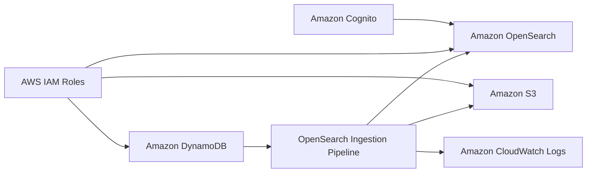

# Real-time Data Ingestion with OpenSearch and Amazon DynamoDB: A Zero-ETL Pipeline
### OpenSearch Zero-ETL Pipeline 

Este repositorio contiene un stack de CDK que despliega una arquitectura de ingesta de datos en tiempo real utilizando Amazon OpenSearch y Amazon DynamoDB. La arquitectura se basa en el servicio Amazon OpenSearch Ingestion (OSIS) para procesar y transformar los datos de forma eficiente.

## Componentes principales

- **[Amazon Cognito](https://docs.aws.amazon.com/es_es/cognito/latest/developerguide/what-is-amazon-cognito.html)**: Se crea un pool de usuarios de Cognito para autenticar el acceso al dominio de OpenSearch. Incluye la configuración del pool, cliente y dominio.

- **[AWS Identity and Access Management Roles](https://docs.aws.amazon.com/es_es/IAM/latest/UserGuide/id_roles.html)**: Se definen los roles de IAM necesarios para que OpenSearch Ingestion pueda acceder a los recursos requeridos, como DynamoDB, S3 y el propio dominio de OpenSearch. 

- **[Amazon OpenSearch](https://docs.aws.amazon.com/es_es/opensearch-service/latest/developerguide/what-is.html)**: Se aprovisiona un dominio de OpenSearch con capacidad de 3 nodos de datos y 3 nodos maestros. Se habilita el cifrado en reposo con EBS y se configura la autenticación con Cognito.

- **[Amazon S3](https://docs.aws.amazon.com/es_es/AmazonS3/latest/userguide/Welcome.html)**: Se crea un bucket de S3 para almacenar backups de la ingesta de datos, con configuración de cifrado, control de acceso y versionado.

- **[Amazon DynamoDB](https://docs.aws.amazon.com/es_es/amazondynamodb/latest/developerguide/Introduction.html)**: Se define una tabla de DynamoDB que será la fuente de datos para la ingesta en OpenSearch. Cuenta con una clave de partición (id) y una clave de ordenación (timestamp). Se habilita el point-in-time-recovery y stream de registros.

- **[Amazon CloudWatch Logs](https://docs.aws.amazon.com/AmazonCloudWatch/latest/logs/WhatIsCloudWatchLogs.html)**: Se configura un grupo de logs en CloudWatch para almacenar los registros generados por la pipeline de OpenSearch Ingestion.

- **[OpenSearch Ingestion Pipeline](https://docs.aws.amazon.com/opensearch-service/latest/developerguide/ingestion.html)**: Es el componente central que define la pipeline de ingesta. Toma la configuración en formato YAML que especifica las fuentes, transformaciones y destino de los datos. Se establece la capacidad mínima y máxima de la pipeline. Se habilita el logging a CloudWatch.

## Diagrama



El diagrama muestra los siguientes componentes y sus relaciones:

- Amazon Cognito autentica el acceso a OpenSearch.
- Los roles de IAM permiten el acceso de OpenSearch Ingestion a DynamoDB, S3 y OpenSearch.
- DynamoDB es la fuente de datos para la ingesta.
- La OpenSearch Ingestion Pipeline procesa los datos desde DynamoDB hacia OpenSearch.
- Los backups se almacenan en S3.
- Los logs se envían a CloudWatch Logs.

## Configuración

Para desplegar este stack es necesario:

1. Tener una cuenta de AWS y credenciales configuradas 
2. Tener el CDK instalado y actualizado
3. Clonar este repositorio 
4. Ejecutar `npm install` para instalar las dependencias
5. Verificar que el archivo `cdk.json` tenga las configuraciones deseadas (región, cuenta, etc)
6. Ejecutar `cdk deploy` para desplegar el stack en la cuenta de AWS

Nota: Algunos recursos como el dominio de Cognito requieren una configuración adicional manual posterior al despliegue, como crear usuarios y grupos.

## Limpieza

Para eliminar completamente los recursos desplegados por este stack, ejecutar:

```
cdk destroy
```

Esto eliminará todos los recursos aprovisionados de forma automática, ya que se ha configurado la política de borrado en `DESTROY` para los principales componentes.

## Conclusión

Este repositorio proporciona una solución completa y eficiente para implementar una arquitectura de ingesta de datos en tiempo real utilizando Amazon OpenSearch y Amazon DynamoDB. Al aprovechar el poder del stack de AWS CDK, se simplifica el proceso de despliegue y configuración, permitiendo a los usuarios centrarse en el análisis y la obtención de insights a partir de sus datos. La combinación de OpenSearch, DynamoDB y el servicio de ingesta de OpenSearch (OSIS) elimina la necesidad de complejos procesos ETL, lo que resulta en un pipeline de ingesta de datos más ágil y escalable. 

En resumen, este repositorio es un recurso valioso para aquellos que buscan implementar una arquitectura de ingesta de datos en tiempo real de manera rápida y sencilla, aprovechando al máximo las capacidades de Amazon OpenSearch y DynamoDB.

## Más información

- [Documentación Amazon OpenSearch Ingestion](https://docs.aws.amazon.com/opensearch-service/latest/developerguide/osis.html)
- [Guía de desarrollador de DynamoDB](https://docs.aws.amazon.com/amazondynamodb/latest/developerguide/)
- [Documentación Amazon Cognito](https://docs.aws.amazon.com/cognito/latest/developerguide/)

## 🚨¿Te gusto? 👩🏻‍💻 ¿Tienes comentarios?🎤 cuéntamelo todo --> [acá](https://www.pulse.aws/survey/WC6WAFGM)

----

## ¡Gracias!

Te dejo mis redes: 
🇻🇪🇨🇱 [Dev.to](https://dev.to/elizabethfuentes12) [Linkedin](https://www.linkedin.com/in/lizfue/) [GitHub](https://github.com/elizabethfuentes12/) [Twitter](https://twitter.com/elizabethfue12) [Instagram](https://www.instagram.com/elifue.tech) [Youtube](https://www.youtube.com/channel/UCr0Gnc-t30m4xyrvsQpNp2Q)
[Linktr](https://linktr.ee/elizabethfuentesleone)

---

## Security

See [CONTRIBUTING](CONTRIBUTING.md#security-issue-notifications) for more information.

## License

This library is licensed under the MIT-0 License. See the LICENSE file.

